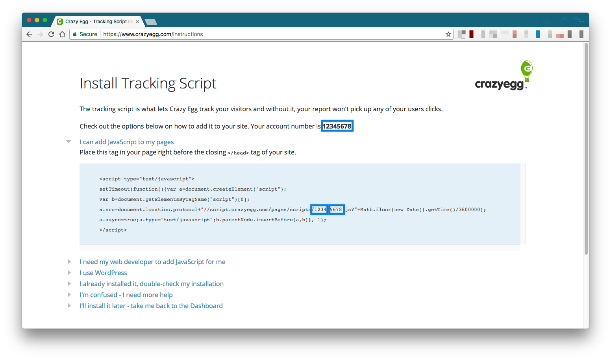

# gitbook-plugin-crazyegg
[CrazyEgg](https://www.crazyegg.com) for Gitbook

### How to use?

Add plugin to your `book.json`, then run `gitbook install`:

```json
{
    "plugins": ["crazyegg"]
}
```

Configure crazyegg account number:



Crazyegg's script breaks your account number into a substring of 4 digits each, include both in the `pluginsConfig`

```json
{
    "plugins": ["crazyegg"],
    "pluginsConfig": {
        "crazyegg": {
            "partOne": "1234",
            "partTwo": "5678"
        }
    }
}
```

### Inspiration
Inspired by: https://github.com/chudaol/gitbook-plugin-gtm